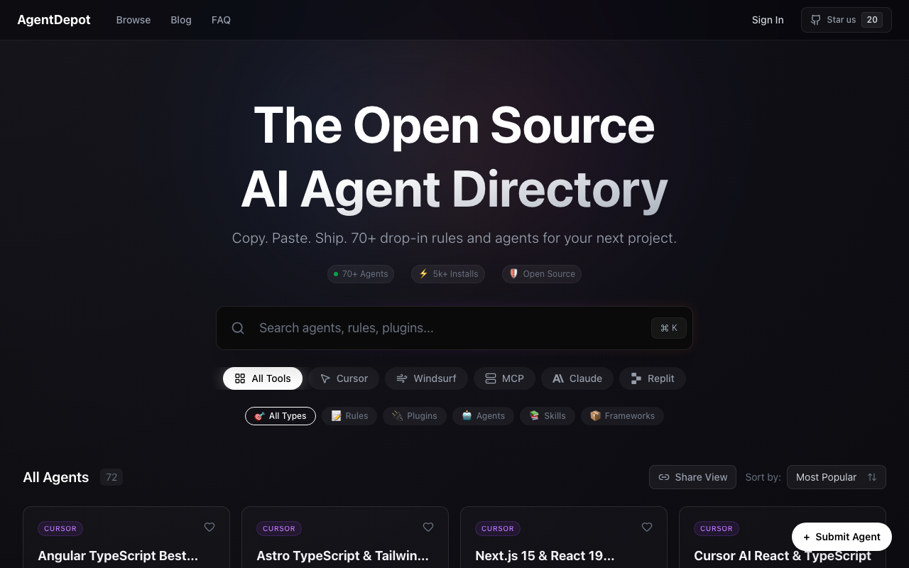

# AgentDepot

**An open directory of AI coding tools — agents, rules, plugins, skills, and MCP servers — for Cursor, Windsurf, Claude Code, Replit, and the Model Context Protocol.**

[](https://github.com/biagruot/agent-depot/actions/workflows/ci.yml)
[](LICENSE)
[](https://agentdepot.dev)

🌐 **Live:** [agentdepot.dev](https://agentdepot.dev)



---

## What it is

The AI coding ecosystem is fragmented: Cursor rules live in one place, Claude Code skills in
another, MCP servers scattered across GitHub. AgentDepot pulls them into one searchable
directory so you can find a tool, see how to install it, and copy the command — in seconds.

- **70+ curated tools** across five platforms (Cursor, Windsurf, Claude Code, Replit, MCP)
- **Instant fuzzy search** and filtering by tool, type, and category — all reflected in the URL so any view is shareable
- **One-click install commands** and per-tool detail pages
- **Open and community-driven** — anyone can add a tool with a pull request

## Tech stack

| Area | Choice |
| --- | --- |
| Framework | Next.js 16 (App Router, React 19.2, React Compiler) |
| Language | TypeScript (strict) |
| Styling | Tailwind CSS 4 (custom glassmorphism, dark theme) |
| Search | Fuse.js (client-side fuzzy search) |
| Auth | Supabase (GitHub OAuth — powers favorites) |
| Email | Resend (newsletter) |
| Analytics | OpenPanel (privacy-focused) |
| Animation | Framer Motion |
| Hosting | Netlify |

## Architecture

A few deliberate choices keep this fast and easy to contribute to:

- **The catalog is data-as-code.** Tools are plain TypeScript modules in `src/data/`, bundled at
  build time — no catalog database. Pages are statically generated, so the site is fast and every
  change is reviewable as a normal diff.
- **Catalog data lives in a companion repo.** The actual tool definitions and the shared `Agent`
  schema are maintained in [`agentdepot-agents`](https://github.com/biagruot/agentdepot-agents),
  where the community contributes via PR. `scripts/sync-agents.sh` copies that data into this
  app's `src/data/`. This separates "the app" from "the catalog" so contributors never touch
  application code.
- **State lives in the URL.** Search query and filters are encoded as query params, so any
  filtered view (`/?q=react&tool=cursor&type=rule`) is shareable and reloadable.
- **Search is client-side.** Fuse.js indexes the catalog in the browser — no backend round-trips,
  which is plenty fast at the current scale.

```
src/
├── app/             # App Router: (main) pages, [tool] pages, embed, api, auth
├── components/      # UI components (+ auth/, providers/)
├── hooks/           # Scroll / time / page tracking hooks
├── lib/             # analytics, resend, utils, supabase clients
├── data/            # Catalog (synced from agentdepot-agents) + collections + blog
└── types/           # Agent and Collection types
```

## Getting started

**Prerequisites:** Node.js 20+ and npm.

```bash
git clone https://github.com/biagruot/agent-depot.git
cd agent-depot
npm install
npm run dev
```

Open [http://localhost:3000](http://localhost:3000). The app runs with **no configuration** —
auth and the newsletter degrade to no-ops when their env vars are absent.

### Environment variables (optional)

To enable auth, analytics, and the newsletter, create `.env.local`:

```bash
# Auth — Supabase (https://supabase.com/dashboard/project/_/settings/api)
NEXT_PUBLIC_SUPABASE_URL=https://your-project.supabase.co
NEXT_PUBLIC_SUPABASE_ANON_KEY=your-anon-key

# Analytics — OpenPanel (https://openpanel.dev)
NEXT_PUBLIC_OPENPANEL_CLIENT_ID=your-client-id

# Newsletter — Resend (https://resend.com/api-keys)
RESEND_API_KEY=re_your_api_key
RESEND_AUDIENCE_ID=your-audience-id
# RESEND_FROM_EMAIL="AgentDepot <hello@agentdepot.dev>"  # defaults to Resend sandbox
```

### Scripts

```bash
npm run dev          # start the dev server
npm run build        # production build
npm run lint         # ESLint
npm run typecheck    # tsc --noEmit
npm test             # Vitest
npm run format       # Prettier (write)
```

## Contributing

- **Adding or editing a tool?** That happens in the catalog repo,
  [`agentdepot-agents`](https://github.com/biagruot/agentdepot-agents) — see its
  [CONTRIBUTING guide](https://github.com/biagruot/agentdepot-agents/blob/main/CONTRIBUTING.md).
  Tools must be **free to use**. Maintainers sync approved changes here with
  `scripts/sync-agents.sh`.
- **Improving the app itself?** PRs welcome. Please run `npm run lint`, `npm run typecheck`, and
  `npm run build` before opening one.

## License

[MIT](LICENSE) © Biagio Ruotolo
